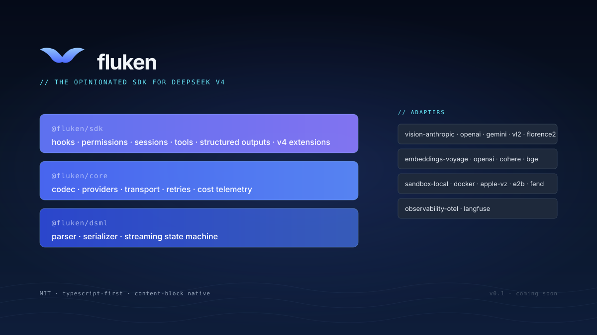

<p align="center">
  
</p>

<p align="center">
  <em>the opinionated typescript sdk for deepseek v4</em>
</p>

<p align="center">
  <a href="#status"></a>
  <a href="./LICENSE"></a>
  <a href="https://github.com/Lisovate/fluken/stargazers"></a>
</p>

---

deepseek's mindset (cheap, open, fast) deserves a real ecosystem around it. fluken is the start of one.

it's a typescript sdk shaped around what v4 actually does, instead of squeezing it into a generic chat-completions API like everything else seems to. you get native content blocks for text, tool_use, and thinking, per-provider endpoint optimization, and the kind of primitives (best-of-N, cost ceilings, multi-verifier ensembles) that only really make sense at v4's prices.

## why this exists

pretty much every existing SDK treats v4 as one more entry in a flat OpenAI-shape provider list, and a bunch of stuff gets lost in translation:

- `reasoning_content` doesn't round-trip in multi-turn tool flows. you get a 400 on the 2nd request.
- native DSML tool calls get reverse-translated through OpenAI's flat schema and arrive mangled.
- prefix-caching semantics are ignored. prompts get reordered, hit rates tank.
- the thinking / non-thinking toggle gets swallowed somewhere along the way.
- there's nowhere natural to put v4's actual economics. best-of-N at $0.05, multi-verifier ensembles, cost ceilings tight enough to matter, that kind of thing.

so v4 ends up underperforming because the tooling around it doesn't speak its language. that's the gap fluken's trying to fill.

## what's in v0.1

this is a typescript library you build agent apps on top of. it isn't a proxy or a URL rewriter for an existing client.

**core surface**
- messages api with native content blocks (text, tool_use, thinking, image, document)
- per-provider endpoint optimization (ds-direct / fireworks / openrouter / self-host)
- full `reasoning_content` round-trip handled correctly across all providers
- local v4 tokenizer, so no api round-trip just to count tokens
- prompt construction that's actually aware of v4's prefix-cache behavior
- captured-fixture replay tests covering every known v4 quirk from litellm, vercel ai, sglang, nvidia nim

**agent primitives**
- hook system (`preToolUse`, `postToolUse`, `userPromptSubmit`, `preApiCall`, `preCompact`, `stop`, and friends)
- permission modes (`auto`, `ask`, `plan`, `denyAll`) with allowlist / denylist patterns
- session management (persist, resume, fork, replay)
- structured outputs via zod / effect schema / typebox / valibot
- tool registry with a pluggable sandbox adapter interface

**cheap-model-native**
- `samples` for best-of-N, with pluggable judges
- `verifiers` for multi-angle review ensembles (correctness, security, performance, style)
- `max_cost` budget ceilings that abort mid-stream
- cache telemetry on every response (hit rate, cost saved, provider used)
- provider fallback with cache-key continuity
- ast-aware code-edit primitives (`read_code`, `edit_code` work on entities, not line numbers)

**feature synthesis** (the things v4's anthropic endpoint doesn't natively support)
- vision via a deterministic pipeline (sharp + paddleocr + rf-detr) with configurable vlm fallback
- web_search, code_execution, bash, text_editor tools
- mcp connector
- batch api shim
- files api shim
- token counting

## what it's *not*

so people stop asking:

- **not a proxy.** deepclaude, claude-code-router, free-claude-code already cover that pattern. fluken sits at a different layer.
- **not a generic 100-provider router.** litellm does that well. fluken is opinionated and deep instead of broad.
- **not a hosted gateway.** no virtual keys or billing in scope for the sdk. could become a separate product later.
- **not a cli.** a `fluken-code` cli might come later, built on top of this sdk. not in v0.1.
- **not a python sdk.** typescript-first. python port if community demand picks up.

## architecture

three packages in one monorepo:

```
@fluken/dsml    parser + serializer for v4's native tool-call format
@fluken/core    codec + providers + transport + retries + cost telemetry
@fluken/sdk     hooks + permissions + sessions + tools + cheap-model extensions
```

plus pluggable adapter packages, each a separate npm install:

```
@fluken/vision-*           anthropic / openai / gemini / vl2 / florence2
@fluken/embeddings-*       voyage / openai / cohere / jina / bge-local
@fluken/sandbox-*          local / docker / apple-vz / e2b / fend
@fluken/observability-*    otel / langfuse
```

think [`@anthropic-ai/claude-agent-sdk`](https://platform.claude.com/docs/en/agent-sdk/overview) or [`@openai/agents`](https://github.com/openai/openai-agents-js) for the rough mental model, not a proxy.

## design principles

1. **anthropic-shape as canonical.** content blocks beat flat schemas on richness, and they're easier to translate down to openai than the other way around.
2. **library is primary, cli is downstream.** plenty of products should be able to consume `@fluken/sdk` (web apps, ide plugins, ci bots, the fluken-code cli when it exists).
3. **codec layer is pure.** no i/o. fully testable from fixtures.
4. **provider adapters handle wire, codec handles format.** clean separation; one less place for bugs to hide.
5. **optional features stay optional.** vision, embeddings, observability, sandboxing all sit behind adapter interfaces with separate first-party packages. core install stays small.
6. **mit-pure.** no agpl anywhere in the tree. apache-2.0 ok with notice preservation.
7. **no backwards-compat shims at 0.x.** breaking changes bump minor and that's fine.

## status

**pre-implementation.** scaffolding right now.

| phase | status |
|---|---|
| research + competitive analysis | done |
| architecture locked | done |
| monorepo scaffolding | in progress |
| phase 1: `@fluken/dsml` parser / serializer | planned |
| phase 2: `@fluken/core` with ds-direct provider | planned |
| phase 3: multi-provider + opentelemetry | planned |
| phase 4: `@fluken/sdk` primitives | planned |
| phase 5: synthesis + tool ecosystem | planned |
| phase 6: v4-native extensions | planned |
| phase 7: public release | planned |

building in public. updates land here and on [@PaweJLisowski](https://x.com/PaweJLisowski).

## follow along

- **star this repo** to get v0.1 release notifications
- **follow [@PaweJLisowski](https://x.com/PaweJLisowski)** for build-in-public progress
- **watch [milestones](https://github.com/Lisovate/fluken/milestones)** for phase progress

## faq

**when does v0.1 release?**
when it's ready. i'll have a tighter estimate once phase 1 (`@fluken/dsml`) lands.

**why not just contribute to litellm or the vercel ai sdk?**
they're slowly converging on the basic plumbing fixes, but neither is going to add cheap-model-native primitives (best-of-N, multi-verifier, max_cost) or the agent-sdk-level surface (hooks, permissions, sessions). different products, different scopes.

**will there be separate handling for v4-flash and v4-pro?**
no, both are equally supported. some features (best-of-N with judges, multi-verifier) were designed around flash economics, but nothing stops you from using them with pro.

**python?**
typescript-first for v0.1. python port if community demand shows up after.

**can i use this with non-deepseek models?**
the architecture would allow it (the provider matrix could grow to glm-flash, k-series, v5-flash, etc.) but v0.1 only ships deepseek-v4. being opinionated about v4 is the whole point.

**license?**
mit.

## license

[mit](./LICENSE) © [lisovate](https://github.com/Lisovate)

---

<p align="center"><sub>built by <a href="https://x.com/PaweJLisowski">pawel</a> at <a href="https://github.com/Lisovate">lisovate</a></sub></p>
